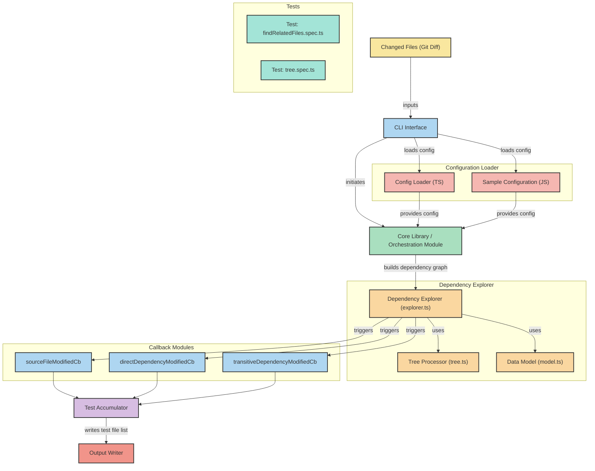

## find-related-tests-js [](https://badge.fury.io/js/find-related-tests-js)

Sometimes we need not run all unit tests in our project. This library will try to find the related files(i.e import files) of all files changed in current branch.

This library can be an alternate for jest findRelatedTests or jest changedSince with much more flexibility. Here consumers are responsible to map test file for each related source file.

``npm install --save find-related-tests-js``

---

### Usage
1. Provide changeSet i.e files modified in git as input stream. 
2. This library will load and process dependency graph for the application and provide the following three callbacks to identify related test files.

Callbacks: 
* sourceFileModifiedCb(fileName, accumulator) => This will be called if a file name found in changeSet. Use this to map test file for modified source file.
* directDependencyModifiedCb(fileName, accumulator) => This will be called if any of the imports of a file is modified.
* transitiveDependencyModifiedCb(fileName, accumulator) => This will be called if one of transitive dependency is modified.

Accumulator:
* Every callback provides this to add test file name for give source file like `accumulator.add(testFileName)`. The result will be unique so need to not worry about duplicates.

```
// config.js
// mandatory parameters

function mapSourceToTestFiles(sourceFile, accumulator) {
    if (sourceFile.indexOf('.test.js') >= 1) {
        // Add if this is already a test file
        accumulator.add(sourceFile)
        return
    }

    if (sourceFile.indexOf('.js') >= 1) {
        // Map multiple test files for single source file
        accumulator.add(sourceFile.replace(/\.js/, '.test.js'));
        accumulator.add(sourceFile.replace(/\.js/, '.snapshot.js'));
    }
}

module.exports = {
    entryPoint: '/react/sample/App.js',
    searchDir: '/react/sample',
    dependencyExcludeFilter: path => path.indexOf('node_modules') === -1, // Ignore node module from dep graph
    // It is okay to add same file name in multiple callback
    // result will be unique
    sourceFileModifiedCb: mapSourceToTestFiles,
    directDependencyModifiedCb: mapSourceToTestFiles,
    transitiveDependencyModifiedCb: (sourceFile, accumulator) => {
        // This will be called if any transitive dependency is modified
        // A -> B -> C -> D
        // C & D are transitive dependency for A
    },
    outputFile: '/react/temp.txt',
}

```

  


#### Run via command line

To findRelatedTests for staged files in Git

```
git diff --name-only | xargs printf -- "$PWD/%s\n" | find-related-tests-js --configPath $PWD/config.js --entryPoint $PWD/App.js --searchDir $PWD/src --outputFile temp.txt
```

To findRelatedTests for files committed but not pushed 

```
git diff --name-only origin..head | xargs printf -- "$PWD/%s\n" | find-related-tests-js --configPath $PWD/config.js --entryPoint $PWD/App.js --searchDir $PWD/src --outputFile temp.txt
```

If you have not installed this package globally then use ``./node_modules/find-related-tests-js/dist/cli.js`` as executable.


#### Test Runner

Above command will find all related test files and write their path to configured output file.
Run test candidates with required runner 

```yarn jest $(cat temp.txt)```


